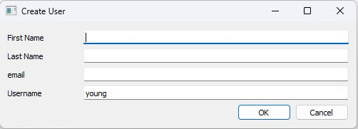
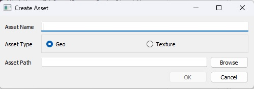
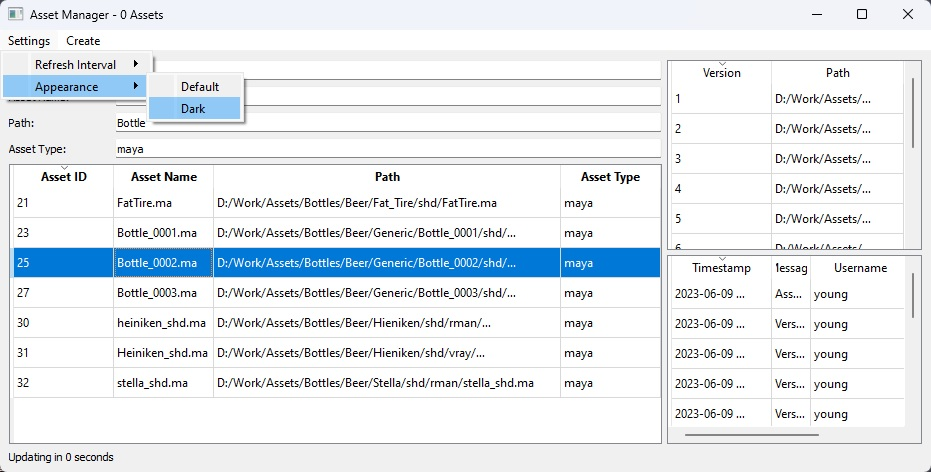
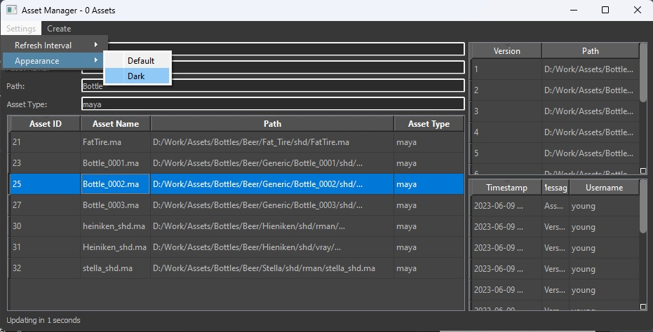
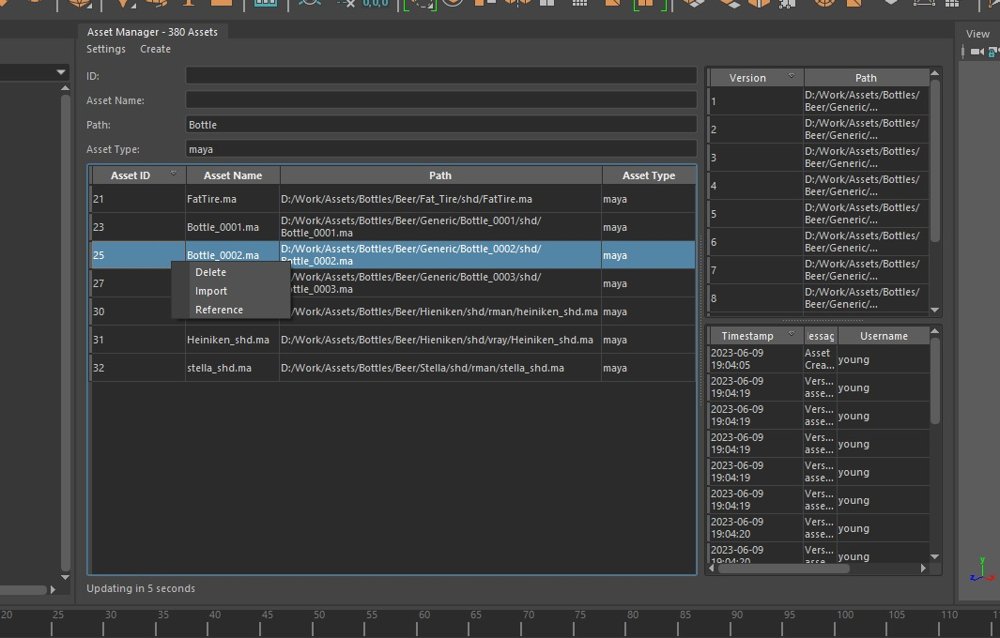

# Asset Manager

## Intentions
The goal of this project was to learn various design concepts related to Python, Qt, Docker, and MySQL. As well as to improve my coding skills.

### Concepts Demonstrated:

**Qt**:
- Model/View viewmodel (MVVM) Architecture
- Custom Signal/Slots
- Stylesheets

**Python**
- Object Oriented Programming
- Multiple Inheritance
- Decoupling
- Context Managers
- Py3 typehints and docstrings

**Docker**
- docker-compose

**MySQL**
- Database design
- Foreign key references
- init files

## The Idea
The idea was to create a CG asset manager that could operate as a standalone application or inside any PySide2 compatible DCC application.  This design uses a core ui class to handle the general interface and common functionality. Separate launcher scripts can then define a window class which inherits the core ui and add addtional application specific functions and ui elements as needed. A launcher for standalone and Maya are included to demonstrate this.

A database design principle I wanted to adhere to is that all file paths must be absolute paths to an existing file. All logic for determining how and where to save a file should be done prior to inserting into the database. No additional path resolution should be needed when the location of an asset is requested. All that needs to be done is to read the path field and pass it to the next operation (Open, Import, Reference, etc). It also avoids hard coding pipeline specific naming conventions and filesystem hierarchy in the core api.


## Disclaimers
This is a proof-of-concept level project, not intended for production use. Very minimal security measures are implemented.

### Requirements
- python 3+
    
    mysql-connector-python

    PySide2

- Docker or Docker Desktop

- Maya 2022+ (optional):

    mysql-connector-python must be installed to the mayapy environment:

    ```mayapy.exe -m pip install mysql-connector-python```

## Instructions
1. Create an environment variable "AMAN" pointing to aman.conf
2. Construct the docker containers with the included yaml file:

    ```docker-compose -f .\docker-compose.yaml up -d```
    
    This will create a database and adminer container. The adminer container provides a useful web-ui for managing the database.

3. Wait for the database container to finish initializing:
    ```
    > docker-compose logs database
    ...
    ...
    [Entrypoint]: MySQL init process done. Ready for start up.
    ...
    ...
    [Server] /usr/sbin/mysqld: ready for connections.

4. Execute the aMan_standalone launcher:
    
    ```python ./aMan_standalone.py```

5. On startup, asset manager will check if the current system user is found in the database "users" table.  Since this is the first time running, the users table will be empty, so a Create User dialog will be presented. The username field is read-only as it is required, all other fields are optional.

    

6. To add an asset to the database, click Create>Asset.

7. Give the asset a name and type. Click Browse and select a file.

    
8. Click OK to create an asset in the database. Upon successful creation, the asset table will show the new asset. If an asset with the same file path exists, no new asset is created.

## Launcher Implementations
The following launchers show how the "AssetManager" ui class can be implemented into an application and extended with additional functionality for a given context.
### Standalone
The standalone launcher extends the core ui with an Appearance menu to switch between the default Light mode and a custom Dark mode.



### Maya
The Maya launcher extends the core ui with right-click context menus for the asset table and versions table which call Maya specific commands as well as the ability to dock with the Maya GUI using MayaQWidgetDockableMixin.

